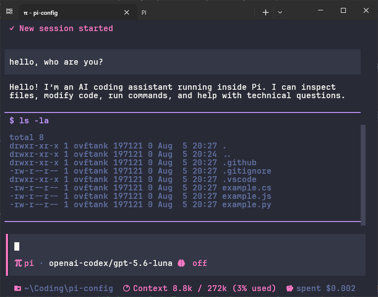
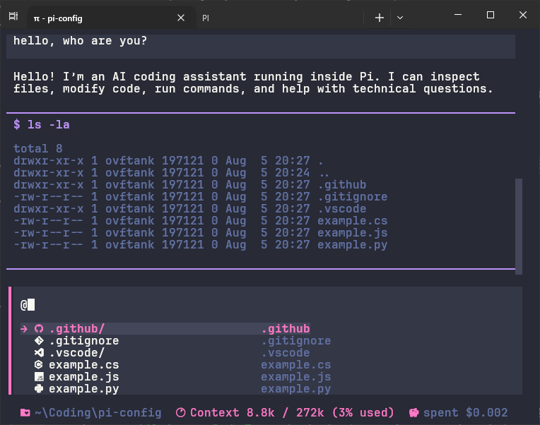

<p align="center">
  
</p>

<h1 align="center">Pi OpenCode Style</h1>

<p align="center">
  A simple OpenCode-style configuration for <a href="https://github.com/earendil-works/pi">Pi Coding Agent</a>.
</p>

## Install

Run this in PowerShell:

```powershell
powershell -NoProfile -ExecutionPolicy Bypass -Command "irm https://raw.githubusercontent.com/ovftank/pi-config/refs/heads/main/.github/install.ps1 | iex"
```

## Showcase

<table>
  <tr>
    <td align="center" width="50%">
      <strong>pi workspace</strong><br/>
      <a href="https://github.com/ovftank/pi-config"></a>
    </td>
    <td align="center" width="50%">
      <strong>file mention</strong><br/>
      <a href="https://github.com/ovftank/pi-config"></a>
    </td>
  </tr>
</table>

## Included

| Feature        | Description                                         |
| -------------- | --------------------------------------------------- |
| MCP support    | Connect external tools and services through MCP.    |
| Web search     | Search and fetch current information from the web.  |
| Chrome control | Inspect and control Chrome through Chrome DevTools. |

